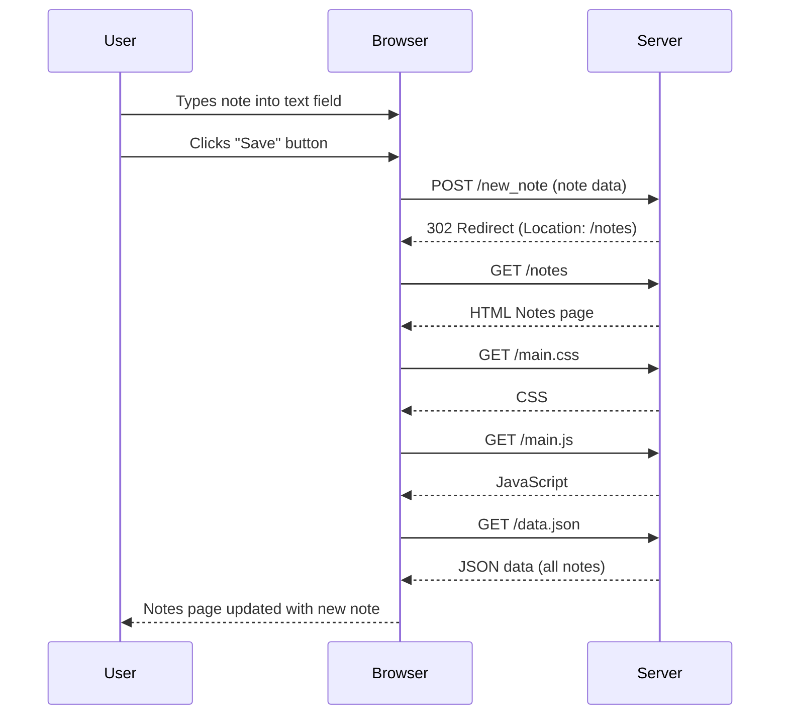

```mermaid
sequenceDiagram
    participant User
    participant Browser
    participant Server

    %% User types a note
    User->>Browser: Types note into text field

    %% User clicks Save
    User->>Browser: Clicks "Save" button
    Browser->>Server: POST /new_note (note data)
    %% Server processes the new note
    Server-->>Browser: 302 Redirect (Location: /notes)

    %% Browser follows redirect
    Browser->>Server: GET /notes
    Server-->>Browser: HTML Notes page

    %% Browser loads additional resources
    Browser->>Server: GET /main.css
    Server-->>Browser: CSS
    Browser->>Server: GET /main.js
    Server-->>Browser: JavaScript
    Browser->>Server: GET /data.json
    Server-->>Browser: JSON data (all notes)

    %% Browser renders page with new note
    Browser-->>User: Notes page updated with new note
```
