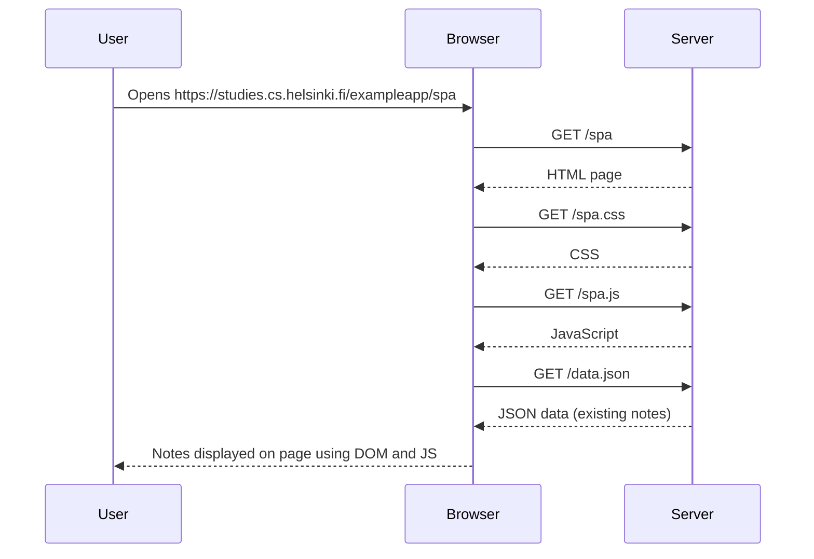

```mermaid
sequenceDiagram
    participant User
    participant Browser
    participant Server

    %% User opens the SPA Notes page
    User->>Browser: Opens https://studies.cs.helsinki.fi/exampleapp/spa
    Browser->>Server: GET /spa
    Server-->>Browser: HTML page

    %% Browser loads resources
    Browser->>Server: GET /spa.css
    Server-->>Browser: CSS
    Browser->>Server: GET /spa.js
    Server-->>Browser: JavaScript
    Browser->>Server: GET /data.json
    Server-->>Browser: JSON data (existing notes)

    %% Browser renders notes
    Browser-->>User: Notes displayed on page using DOM and JS

    
```    
