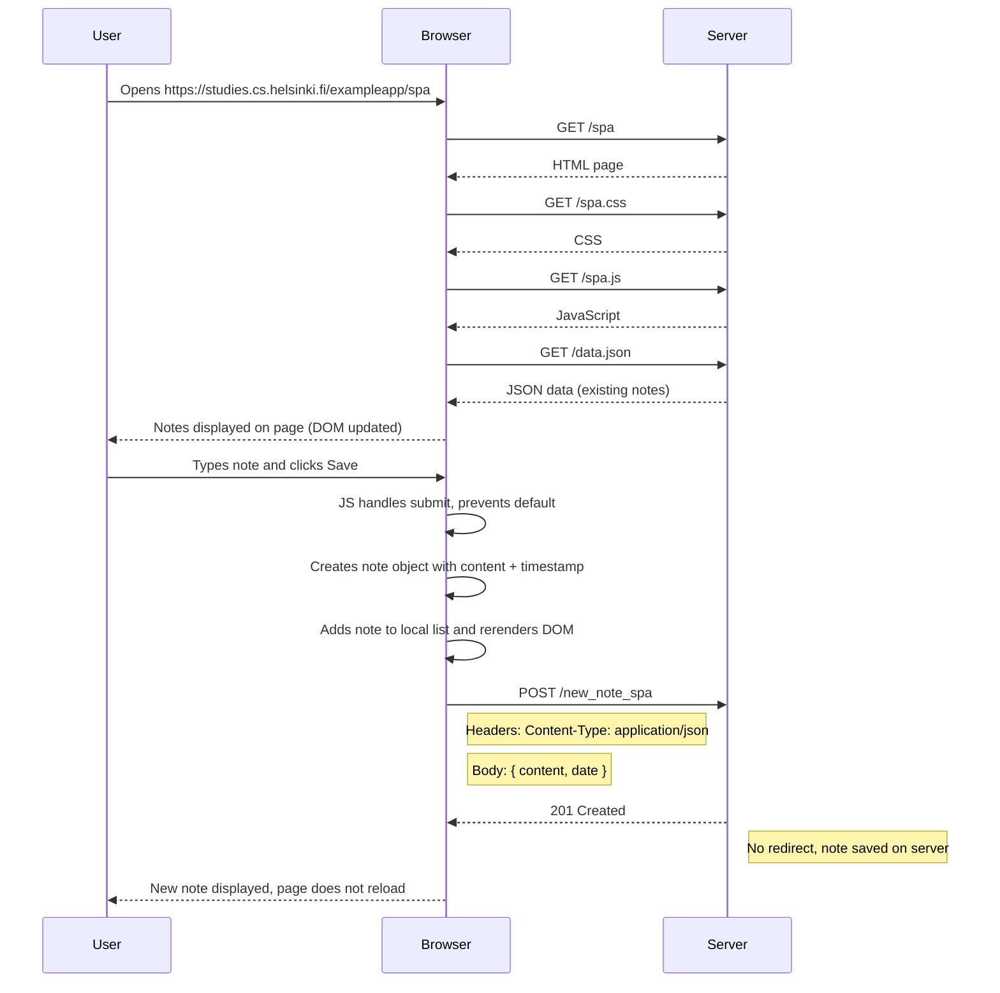

```mermaid
sequenceDiagram
    participant User
    participant Browser
    participant Server

    %% User opens SPA Notes page
    User->>Browser: Opens https://studies.cs.helsinki.fi/exampleapp/spa
    Browser->>Server: GET /spa
    Server-->>Browser: HTML page

    %% Browser loads resources
    Browser->>Server: GET /spa.css
    Server-->>Browser: CSS
    Browser->>Server: GET /spa.js
    Server-->>Browser: JavaScript
    Browser->>Server: GET /data.json
    Server-->>Browser: JSON data (existing notes)

    %% Browser renders notes via JS
    Browser-->>User: Notes displayed on page (DOM updated)

    %% User adds a new note
    User->>Browser: Types note and clicks Save
    Browser->>Browser: JS handles submit, prevents default
    Browser->>Browser: Creates note object with content + timestamp
    Browser->>Browser: Adds note to local list and rerenders DOM

    %% Browser sends POST request
    Browser->>Server: POST /new_note_spa
    Note right of Browser: Headers: Content-Type: application/json
    Note right of Browser: Body: { content, date }
    Server-->>Browser: 201 Created
    Note right of Server: No redirect, note saved on server


    %% Page stays the same
    Browser-->>User: New note displayed, page does not reload
    
```    
