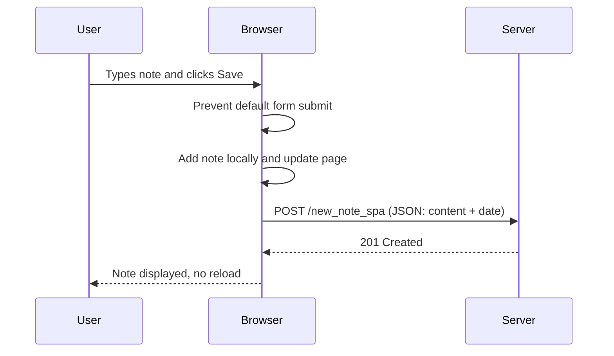

```mermaid
sequenceDiagram
    participant User
    participant Browser
    participant Server

    %% User creates a new note
    User->>Browser: Types note and clicks Save

    %% Browser handles it
    Browser->>Browser: Prevent default form submit
    Browser->>Browser: Add note locally and update page

    %% Browser sends note to server
    Browser->>Server: POST /new_note_spa (JSON: content + date)
    Server-->>Browser: 201 Created

    %% Page stays the same
    Browser-->>User: Note displayed, no reload
```
